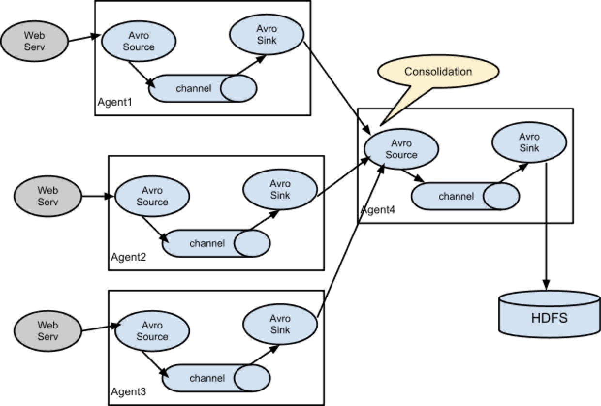

## About Flume

* 分布式、可靠、高可用的海量日志采集、聚合和传输系统
* 支持在日志系统中定制各类数据发送方，用于收集数据;同时，Flume提供对数据进行简单处理，并写到各种数据接受方(比如文本、HDFS、Hbase等)的能力。

## Flume组件

* **Agent**: Flume的核心是agent。agent是一个**java进程**，运行在日志收集端，通过agent接收日志，然后暂存起来，再发送到目的地。
* 三大核心组件：
  1. Source：专用于**收集日志**，可以处理各种类型各种格式的日志数据，包括avro、thrift、exec、jms、spooling directory、netcat、sequence generator、syslog、http、legacy、自定义等。
  2. Channel：专用于**临时存储数据**，可以存放在memory、jdbc、file、数据库、自定义等。其存储的数据只有在sink发送成功之后才会被删除。
  3. Sink：专用于**把数据发送到目的地点**，目的地包括hdfs、logger、avro、thrift、ipc、file、null、hbase、solr、自定义等。

## Flume的可靠性保证

* 为了保证输送一定成功，在送到目的地之前，会**先缓存数据**，待数据真正到达目的地后，删除自己缓存的数据。
* **Flume使用事务性的方式保证传送Event整个过程的可靠性**。（Event：Flume传输的数据的**基本单位**是**Event**，如果是文本文件，通常是一行记录，这也是事务的基本单位。Event 从 Source 流向 Channel，再到 Sink，本身为一个byte数组，并可携带headers信息。Event代表着一个数据流的**最小完整单元**，从外部数据源来，向外部的目的地去。）