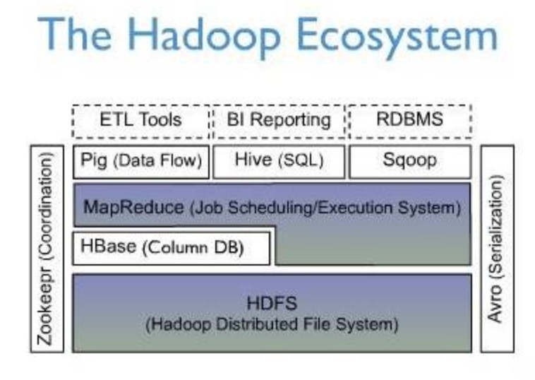
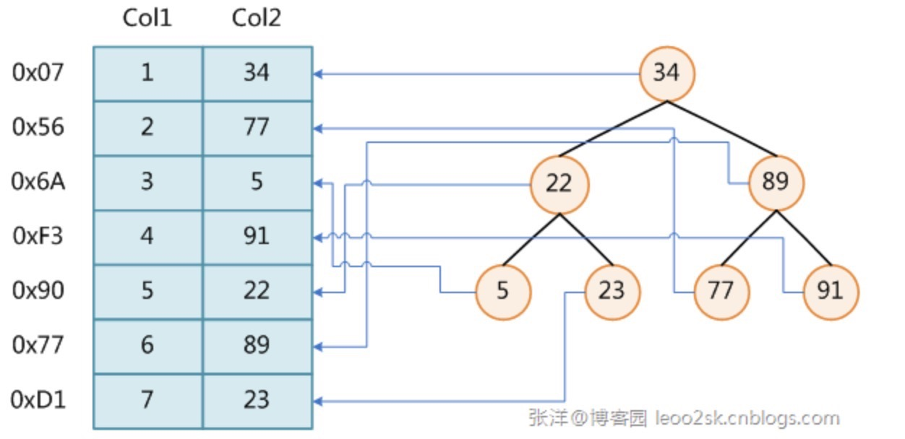

## HBase背景

* 大量业务场景开始考虑数据存储水平扩展，而目前的关系型数据库更专注于一台机器；
* 单台机器无法负载大量数据，海量数据存储称为瓶颈；
* 单台机器I/O读写请求时高并发，大规模请求的瓶颈；
* 当数据进行水平扩展时，如何解决数据IO高一致性问题。结合M/R计算框架进行海量数据的离线分析。

## HBase

* 分布式的、面向列的开源数据库

* HBase中的表的特点：

  * 大：一个表可以有上亿行，上百万列；
  * **面向列**：**面向列(族)的存储和权限控制，列(族)独立检索**；
  * 稀疏：对于为空(null)的列，并不占有存储空间。因此，表可以设计得十分稀疏。

* HBase在Hadoop生态圈的地位：

  * 利用HDFS作为其文件存储系统，即HDFS为HBase提供了高可靠性的底层存储机制。
  * 利用MapReduce来处理HBase中的海量数据，即MR为HBase提供了高性能的计算能力。
  * Pig和Hive还为HBase提供了高层语言支持，使得在HBase上进行数据统计处理变的非常简单。

  

## HBase的数据模型

* 逻辑模型：
  * 表的不同行可以拥有不同数量的成员，即支持**“动态模式”模型**；
  * 列簇：table在水平方向有一个或多个Column Family组成。
* 物理模型

## 行存储VS列存储

## 索引

* 数据库索引：数据库管理系统中的一个排序的数据结构，以协助快速查询、更新数据库表中数据。

* 也就是在数据之外，数据库系统还维护着满足特点查找算法的数据结构，这些数据结构以某种方式引用(指向)数据。如下图：

  

* **实现**：通常使用B树及其变种B+树。

* **代价**：为表设置索引是要付出代价的：

  * **创建索引和维护索引要耗费时间**，这种时间随着数据量的增加而增加。
  * 索引需要**占物理空间**，除了数据表占数据空间之外，每一个索引还要占一定的物理空间，如果要建立聚簇索引，那么需要的空间就会更大。
  * 当对表中的数据进行增加、删除和修改的时候，索引也要动态的维护，这样就降低了数据的维护速度。

* **优势**：

  * 通过创建唯一性索引，可以保证数据库表中每一行数据的唯一性；
  * 可以大大加快数据的检索速度(创建索引的主要原因)；
  * 可以加速表和表之间的连接，特别是在实现数据的参考完整性方面特别有意义；
  * 在使用分组和排序子句进行数据检索时，同样可以显著减少查询中分组和排序的时间。
  * 通过使用索引，可以在查询的过程中，使用优化隐藏器，提高系统的性能。

* 在哪里建索引：

  * 经常需要搜索的列上，加快搜索速度；
  * 主键上，强制该列的唯一性和组织表中数据的排列结构；
  * 在经常用在连接的列上，这些列主要是一些外键，可以加快连接的速度。

* 不适合做索引：

  * 对于那些在查询中很少使用或者参考的列不应该创建索引；
  * 对于那些只有很少数据值的列也不应该增加索引；
  * 对于那些定义为text, image和bit数据类型的列不应该增加索引。这是因为，这些列的数据量要么相当大，要么取值很少；
  * 当修改性能远远大于检索性能时，不应该创建索引。

* 三种类型：

  1. 唯一索引：唯一索引是不允许其中任何两行具有相同索引值的索引。
  2. 主键索引：数据库表经常有一列或列组合，其值唯一标识表中的每一行。该列称为表的主键。在数据库关系图中为表定义主键将自动创建主键索引，主键索引是唯一索引的特定类型。该索引要求主键中的每个值都唯一。当在查询中使用主键索引时，它还允许对数据的快速访问。
  3. 聚集索引：在聚集索引中，表中行的物理顺序与键值的逻辑（索引）顺序相同。一个表只能包含一个聚集索引。

## FYI

* [从B树、B+树、B*树谈到R树](http://blog.csdn.net/v_JULY_v/article/details/6530142/)
* [数据库索引的实现原理](http://blog.csdn.net/kennyrose/article/details/7532032)